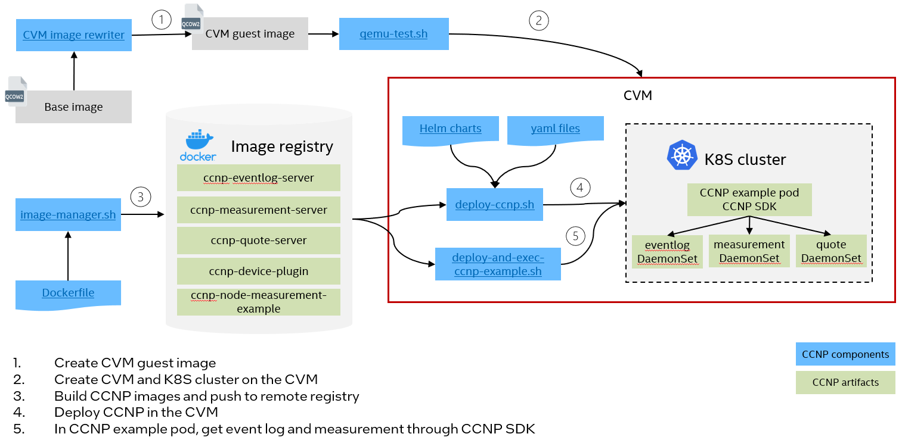

# CCNP Deployment Guide

CCNP is designed for collecting confidential computing primitives in cloud native environments. It's designed to run as DaemonSet on confidential virtual machines nodes, such as Intel Trust Domain (TD), in a Kubernetes cluster. Below diagram illustrates CCNP deployment process. In this document, it will use Intel TD as an example of CVM and deploy CCNP on Intel TD nodes.




## Create TD

You can use [cvm image rewriter](../tools/cvm-image-rewriter/README.md) to prepare a TD enlightened guest image and start a TD using [qemu-test.sh](../tools/cvm-image-rewriter/qemu-test.sh).

## Prepare a K8S cluster with TD as worker nodes

You can either create a K8S cluster in the TD or let the TD join an existing K8S cluster. Please choose one of the following step to make sure the K8S cluster is prepared with the TD running in it. CCNP will be deployed on the TD later.

### Option 1: Create a K8S cluster on the TD
After TDs are started, users need to setup a K8S cluster in the TDs. Please refer to the [k8s official documentation](https://kubernetes.io/docs/home/) for detailed steps. 

_NOTE: If the cluster has only one node (master node), the taint on the node needs to be removed._

### Option 2: Add the TD to an existing K8S cluster
TBD

## Deploy CCNP

The following scripts can help to generate CCNP images and deploy them in the TD nodes.

- [image-manager.sh](../deployment/script/image-manager.sh): The tool will build 5 images and push them to remote registry if required.
- [deploy-ccnp.sh](../deployment/script/deploy-ccnp.sh): The tool will deploy CCNP services as DaemonSet on TDs in the K8S cluster.
- [deploy-and-exec-ccnp-example.sh](../deployment/script/deploy-and-exec-ccnp-example.sh): The tool will deploy an example pod and show getting event logs, measurement and perform verification using CCNP in the pod.

### Prerequisite
- Install Helm on the TD nodes. Please refer to the [HELM quick start](https://helm.sh/docs/intro/quickstart/).
- Install docker on the TD nodes. Please refer to [Get Docker](https://docs.docker.com/get-docker/).
- Install python3-pip on the TD nodes. Please refer to [pip document](https://pip.pypa.io/en/stable/installation/).
- Set access permission to TD device node and ccnp working directory on the TD nodes.
$ sudo mkdir -p /etc/udev/rules.d
$ sudo touch /etc/udev/rules.d/90-tdx.rules

# Check TD device node on TD
$ ls /dev/tdx*

# If above output is "/dev/tdx-guest"
$ sudo bash -c 'echo "SUBSYSTEM==\"misc\",KERNEL==\"tdx-guest\",MODE=\"0666\"">/etc/udev/rules.d/90-tdx.rules'
# If above output is "/dev/tdx_guest"
$ sudo bash -c 'echo "SUBSYSTEM==\"misc\",KERNEL==\"tdx_guest\",MODE=\"0666\"">/etc/udev/rules.d/90-tdx.rules'
# make the udev setup effective
$ sudo udevadm trigger

$ sudo touch /usr/lib/tmpfiles.d/ccnp.conf
$ sudo bash -c 'echo "D /run/ccnp/uds 0757 - - -">/usr/lib/tmpfiles.d/ccnp.conf'
# make the directory setup effective by running below command or restarting the node
$ sudo systemd-tmpfiles --create

```

### Build CCNP images

Run below scripts to generate CCNP images. It will generate 5 images and push them to user specific registry.

_NOTE: The scripts need to run on a server with docker installed._

```
$ cd scripts
$ sudo ./image-manager.sh -r <remote registry> -g <docker image tag>

e.g.

# Build images with tag 0.3 and push them to remote registry test-registry.intel.com
$ sudo ./image-manager.sh -r test-registry.intel.com/test -g 0.3

# Build images only with tag 0.3
$ sudo ./image-manager.sh -a build -g 0.3
```

_NOTE: please set `HTTP_PROXY`, `HTTPS_PROXY`, `NO_PROXY` in your terminal if they are needed in your environments._

After the script is successful, it's supposed to see below docker images.

```
$ sudo docker images
ccnp-node-measurement-example   <your image tag>
ccnp-eventlog-server            <your image tag>
ccnp-measurement-server         <your image tag>
ccnp-quote-server               <your image tag>
ccnp-device-plugin              <your image tag>
```

### Deploy CCNP services
CCNP deployment tool will deploy TDX device plugin and DaemonSets for CCNP event log, measurement and quote.
Run below scripts on each TD node.

```
# Deploy CCNP with user specified remote registry and image tag
$ sudo ./deploy-ccnp.sh -r <remote registry> -g <tag>
e.g.
$ sudo ./deploy-ccnp.sh -r test-registry.intel.com/test -g 0.3

# Delete existing CCNP and Deploy CCNP with user specified remote registry and image tag
$ sudo ./deploy-ccnp.sh -r <remote registry> -g <tag> -d

```

After it's successful, you should see helm release `ccnp-device-plugin` and 3 DaemonSets in namespace `ccnp`.

```
$ sudo helm list
NAME                    NAMESPACE       REVISION        UPDATED                                 STATUS          CHART                           APP VERSION
ccnp-device-plugin      default         1               2023-12-27 08:12:05.814766198 +0000 UTC deployed        ccnp-device-plugin-0.1.0        latest
$ sudo kubectl get ds -n ccnp
NAME                 DESIRED   CURRENT   READY   UP-TO-DATE   AVAILABLE   NODE SELECTOR                                        AGE
eventlog-server      1         1         1       1            1           intel.feature.node.kubernetes.io/tdx-guest=enabled   24h
quote-server         1         1         1       1            1           intel.feature.node.kubernetes.io/tdx-guest=enabled   24h
measurement-server   1         1         1       1            1           intel.feature.node.kubernetes.io/tdx-guest=enabled   24h
$ sudo kubectl get pods -n ccnp
NAME                       READY   STATUS    RESTARTS      AGE
eventlog-server-bk2g5      1/1     Running   2 (39s ago)   24h
quote-server-6lhf6         1/1     Running   0             26s
measurement-server-4q9v7   1/1     Running   0             26s
```

## Install CCNP SDK

There are two options to install CCNP SDK.  
Option 1: Users can run the following command on each work node to install CCNP client library for Python with PyPI.
```
pip install ccnp
```
Option 2: Users can also run the following commands to install CCNP SDK from source code.
```
cd confidential-cloud-native-primitives/sdk/python3/
pip install -r requirements.txt
pip install -e .
```
At this step, CCNP has been installed successfully. For more detailed information, including SDK usage, please refer to [here](https://intel.github.io/confidential-cloud-native-primitives/).


## CCNP example
The script [deploy-and-exec-ccnp-example.sh](../deployment/script/deploy-and-exec-ccnp-example.sh) is an example of using CCNP to collect event log, measurement and perform verification in a pod.
```
$ cd script
# Specify the registry name and tag used in image building
$ sudo ./deploy-and-exec-ccnp-example.sh -r <remote-registry> -g <tag>

# You can also specify which integrity measurement register (RTMR in the case of Intel TD) to verify
# e.g. Show RTMR[1] and RTMR[2] using below command
$ sudo ./deploy-and-exec-ccnp-example.sh -r <remote-registry> -g <tag> -i '1 2'
```

The example output of verification can be found at [sample-output-for-node-measurement-tool-full.txt](../docs/sample-output-for-node-measurement-tool-full.txt) and
[sample-output-for-node-measurement-tool-selected.txt](../docs/sample-output-for-node-measurement-tool-selected.txt)
